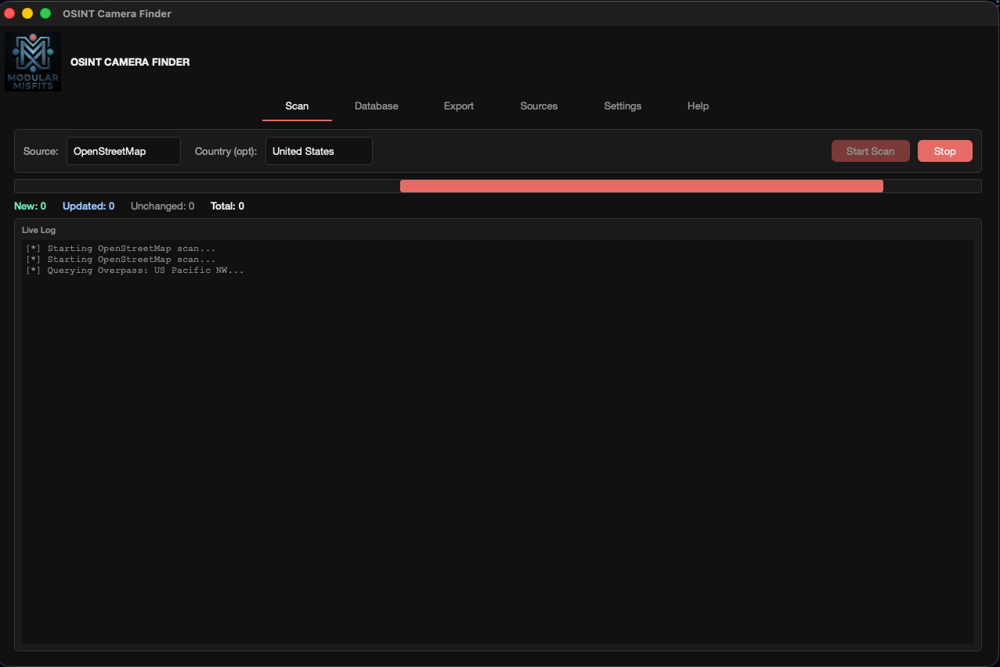

# OSINT Camera Finder

A desktop GUI application for discovering, cataloguing, and exporting publicly accessible cameras worldwide. Scans multiple data sources, stores results in a local SQLite database with delta detection, and exports to JSON.



## Features

- **5 built-in data sources** — Insecam, FAA WeatherCams, OpenStreetMap, Windy Webcams, US DOT Traffic
- **Custom API sources** — add any JSON REST API via the Sources tab without touching code or restarting
- **Persistent SQLite database** — delta detection (new / updated / unchanged) across runs; cameras missing URL and location data are silently discarded
- **Resumable scans** — Insecam skips already-harvested camera IDs so partial runs can continue
- **Parallel scanning** — Insecam page collection and Windy pagination both use 10-thread parallel fetching; Insecam enrichment uses 40 threads
- **Camera categorization** — weather, traffic, tourist, aviation, nature, security, unknown
- **Filterable database view** — filter by source, country, category, status, or free-text search; 200 rows per page
- **JSON export** with the same filter options
- **API key management** — Settings tab stores keys in a local `.env` file, never committed
- **Help tab** — in-app documentation covering all features

## Requirements

```
Python 3.11+
PyQt6
requests
jmespath
colorama
```

```bash
pip install -r requirements.txt
python3 main.py
```

## Data Sources

| Source | Auth | Notes |
|---|---|---|
| Insecam | None | Scraped by country; parallel page fetch (10 threads) + enrichment (40 threads); resumable |
| FAA WeatherCams | None | ~3,400 US aviation weather cameras; requires `Referer`/`Origin` headers |
| OpenStreetMap | None | Overpass API by country; 1,000 nodes per query; bbox sub-regions for large countries |
| Windy Webcams | API key | 85,000+ webcams worldwide; parallel page fetch (10 threads); get a free key at windy.com/api/webcams |
| US DOT Traffic | None | New York 511 open feed; ~1,850 active traffic cameras |

## Custom Sources

Any JSON REST API can be added as a custom source in the **Sources** tab — no code changes, no restart required.

Provide an endpoint URL, optional auth headers or params, a pagination style (`none` / `offset` / `page` / `cursor`), and a field mapping using [jmespath](https://jmespath.org/) dot-notation paths from the JSON response to the camera schema. Use `{ENV_VAR_NAME}` in any string field to inject values from your environment at request time.

Custom source definitions are stored in `custom_sources.json` at the project root (gitignored).

## Architecture

```
main.py                        Entry point — loads .env, launches GUI
app/
  core/
    scanner.py                 Orchestrator thread; routes to source generators; emits UI queue events
    schema.py                  Camera TypedDict and infer_category()
    env_loader.py              .env read/write without overwriting os.environ
    custom_sources.py          Registry, validator, and generator for custom API sources
  db/
    models.py                  SQLite schema (cameras, scan_runs tables)
    store.py                   Upsert with skip guard, delta detection, query, export
  sources/
    insecam.py                 Phase 1: parallel page fetch; Phase 2: ThreadPoolExecutor(40)
    faa.py                     Single API call, flattens site → cameras
    osm.py                     Per-country Overpass queries; bbox fallback for large countries
    windy.py                   Parallel paginated v3 API, 50 cameras/request
    dot_traffic.py             NY 511 open feed parser
  ui/
    main_window.py             Root window, Obsidian Hierarchy theme, 6 tabs
    scan_panel.py              Source selector, live log, progress bar, stats
    database_panel.py          Filterable table, pagination (200/page)
    export_panel.py            Filter + JSON export with file picker
    settings_panel.py          API key management
    custom_sources_panel.py    Create/edit/delete/test custom API sources
    help_panel.py              Static in-app documentation
```

### Thread model

The scanner runs in a daemon thread. All UI updates flow through a `queue.Queue` polled by a `QTimer` every 100ms — no direct cross-thread widget access.

### Delta detection

`store.upsert_camera()` checks 9 fields (url, name, type, category, lat, lon, city, region, state) and returns `'new' | 'updated' | 'unchanged' | 'skipped'`. Records missing both a URL and any usable location data are skipped entirely and never written to the database. After each Insecam scan, `mark_offline()` marks previously-seen cameras that weren't returned in the current run.

### Overpass API notes

- `overpass-api.de` is the only public instance with area relation support — required for per-country queries.
- Large countries (US, Russia, Canada, China, Australia, Brazil, India) use bbox sub-regions instead of area queries to avoid the 60s server timeout.
- US is split into 14 regions; each returns up to 1,000 nodes.
- Retries automatically on 502/503/504 (up to 3 attempts, 10s backoff).

### Windy API notes

- Auth via `x-windy-api-key` header only — query param returns 403.
- `include` values must be comma-separated as a literal string; `requests` percent-encodes commas which causes 400. URL is built manually.
- Hard limit of 50 results per request; all pages fetched in parallel.

## Configuration

Use the Settings tab in the app, or create a `.env` file at the project root:

```
WINDY_API_KEY=your_key_here
```

The `.env` file is gitignored. Keys are never hardcoded.

## Database

`cameras.db` (SQLite, gitignored) — schema:

| Column | Type | Notes |
|---|---|---|
| source | TEXT | Source name |
| camera_id | TEXT | Source-specific ID; `UNIQUE(source, camera_id)` |
| url | TEXT | Stream or viewer URL |
| camera_name | TEXT | |
| camera_type | TEXT | Raw type string from source |
| category | TEXT | weather / traffic / tourist / aviation / nature / security / unknown |
| latitude / longitude | REAL | |
| country / country_code / state / city / region | TEXT | |
| status | TEXT | active / offline |
| first_seen / last_seen | TEXT | ISO 8601 UTC |

## Repo

https://github.com/Modular-Misfits/osint-cam-finder
